
<h1 align="center">冷冻仓储进销存管理系统vue</h1>

## 简介
冷冻仓储进销存管理系统：角色分为管理员、用户；功能包括商品管理、库存监控、订单处理、数据统计，支持进出库记录、用户注册及登录、商品信息管理、入库申请与出库审核等。    --计算机毕业设计源码；毕设源码；java毕业设计源码

## 联系方式

<h3 align="center">获取完整代码与数据库文件 + 微信：deepguan QQ: 86050149 QQ群: 783742310</h3>

<h3 align="center">可帮忙远程部署 包运行成功！提供远程部署、修改代码、设计文档指导、代码讲解等服务！</h3>

## 功能介绍（完整见运行截图）
管理员：管理系统的注册和登录界面提供账户信息输入功能，支持角色选择为“管理员”或“商户”。通过导航菜单，管理员可以进行账户管理、密码保存、商品信息管理、入库和出库记录管理、以及用户中心访问等操作。系统提供模块化功能，包括商品管理、库存监控和数据统计，支持导入文件上传，实现高效的数据处理和库存信息更新。

操作员：可访问以Vue框架开发的冷冻仓储管理界面，进行商品信息的输入与修改、审核出库申请并提交审核意见。通过用户中心与商品管理模块，可以查看商品详情及进行增删改查操作。界面支持商品信息的自动补全并提供文件导入功能，以便轻松管理商品库存和出入库记录。

商家：可在用户注册界面输入商家名称、联系人、及联系信息，以顺利注册并进行后续库存管理和沟通。通过导航菜单访问商户管理、商家信息填写及修改。系统提供报表生成和数据分析功能，帮助商家了解销售趋势和优化库存周转管理的决策。

普通用户：使用便捷的冷冻仓储进销存管理系统，普通用户可以通过商品信息模块提交入库申请，查看出库记录，并通过筛选功能查找库存信息。用户借助个人中心，查看和修改个人信息，系统界面简洁直观，易于操作，适合各类用户进行日常库存管理和信息维护。

## 运行截图
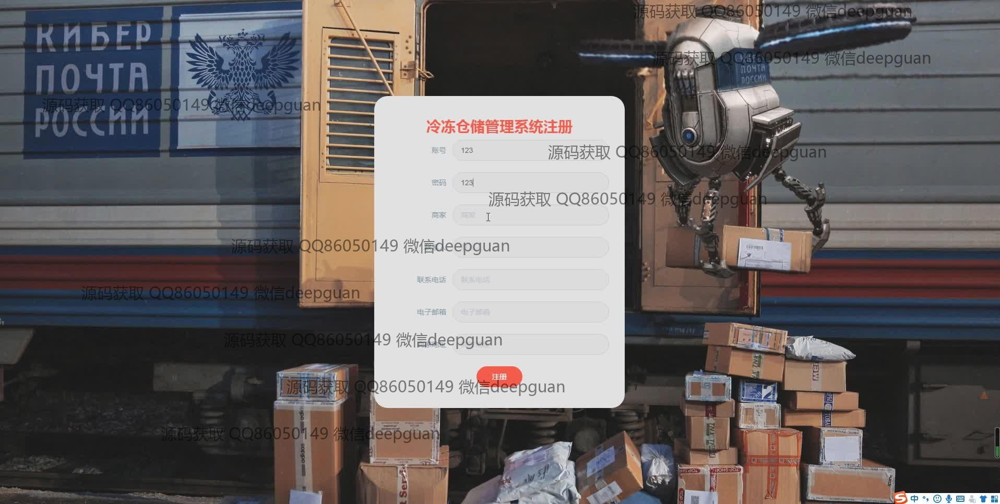
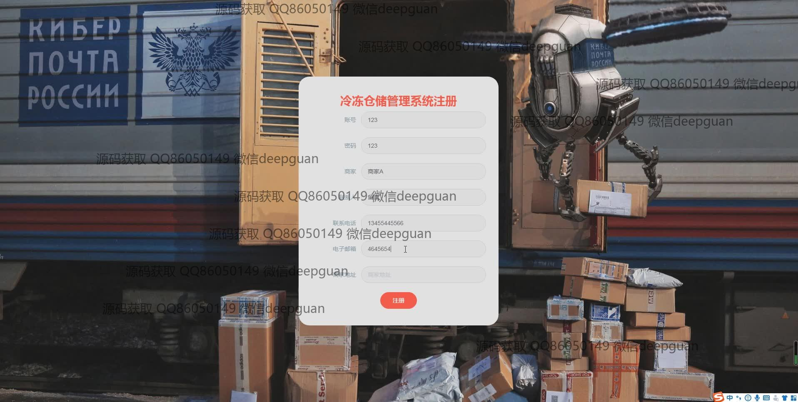
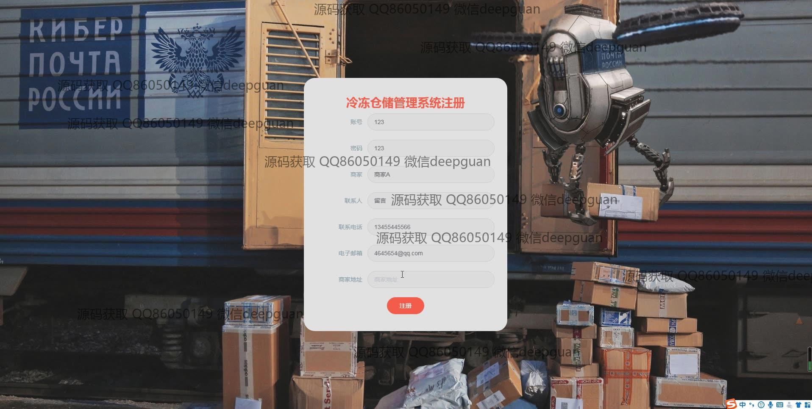
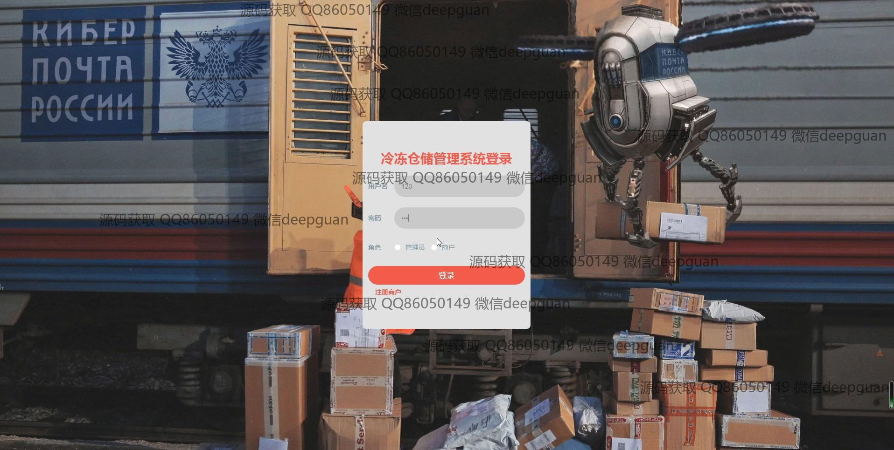
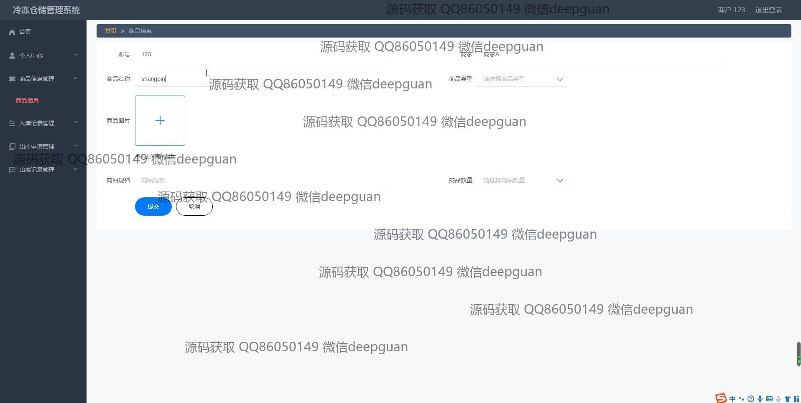
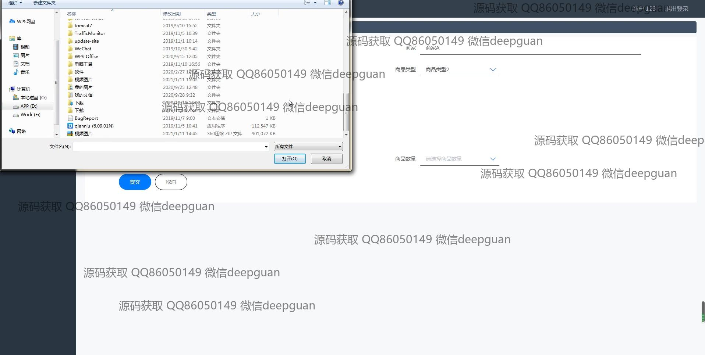
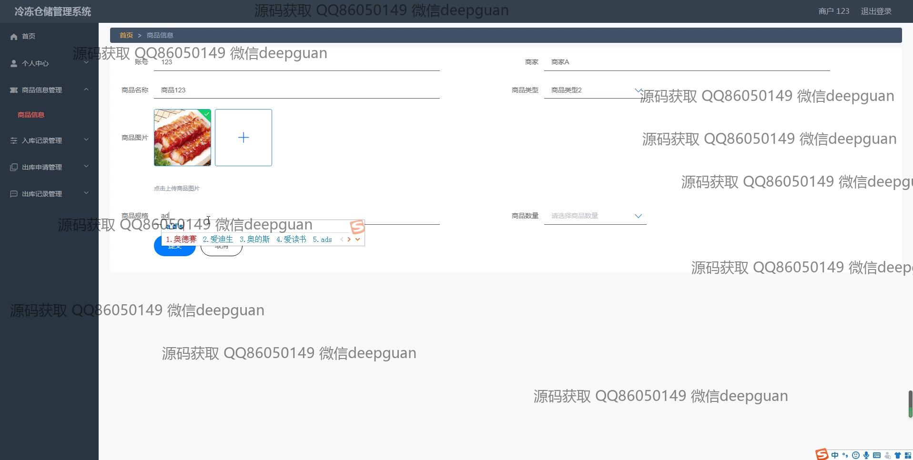
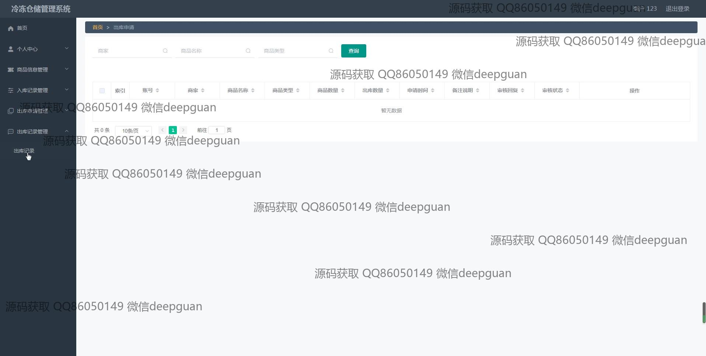
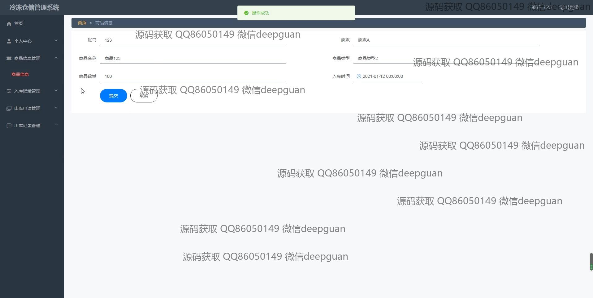
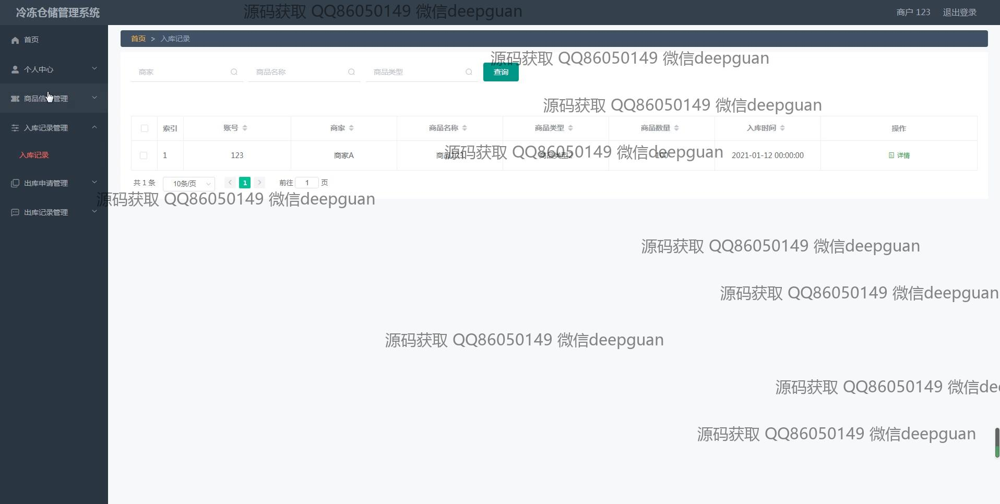
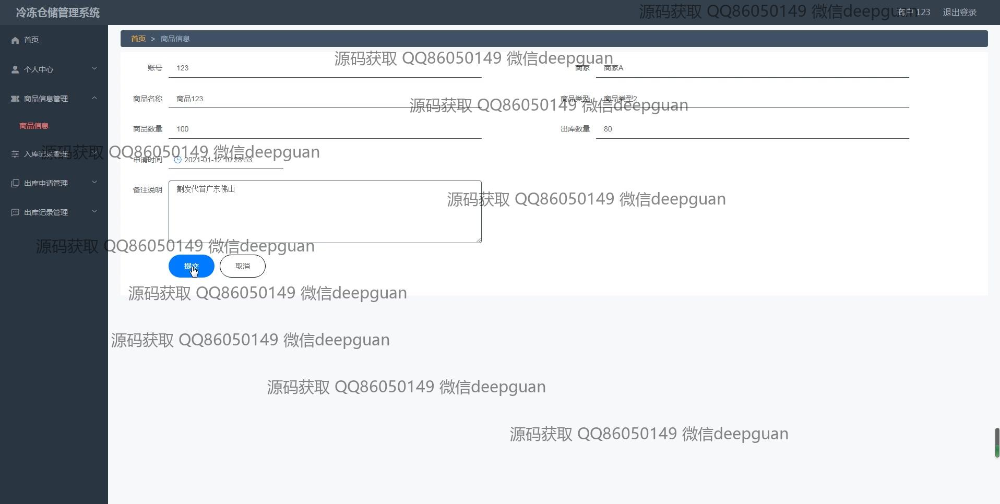
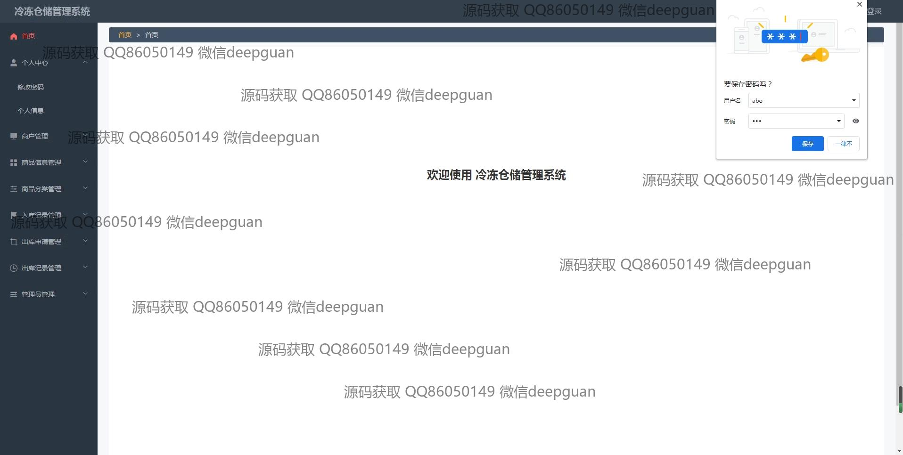
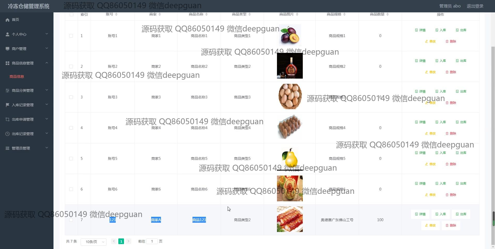
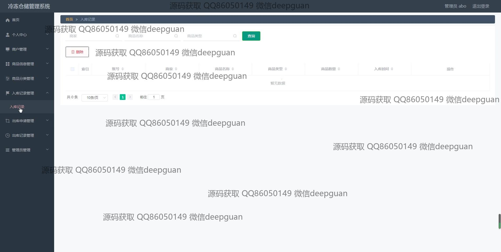
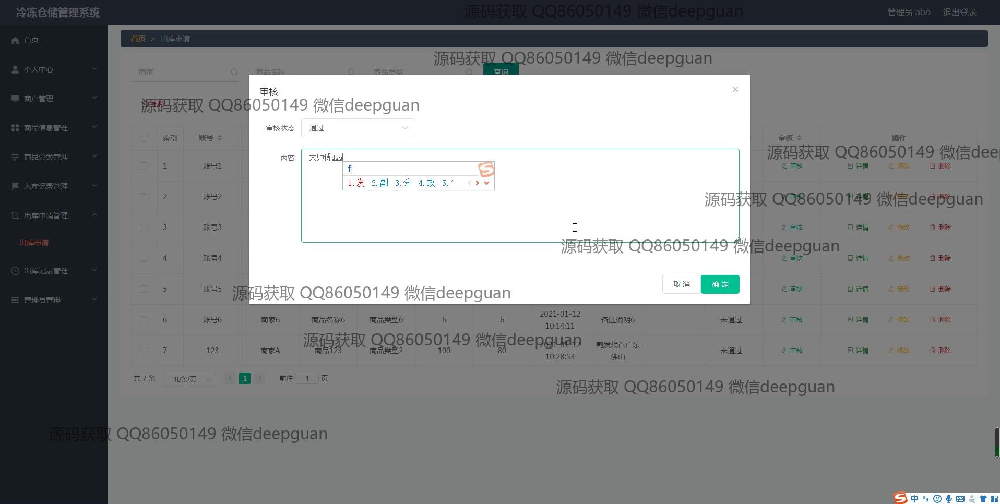
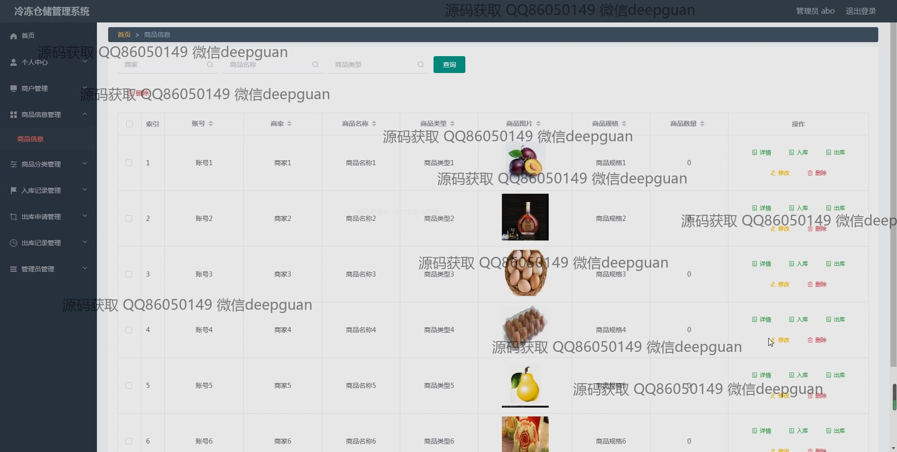
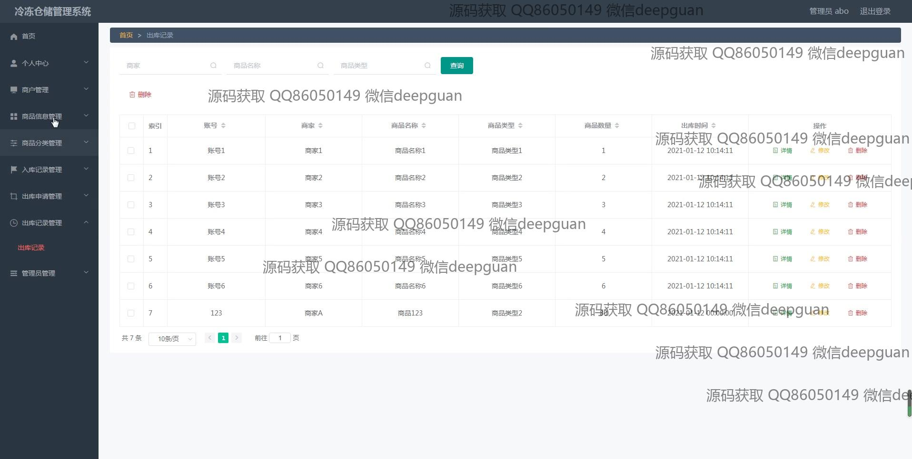
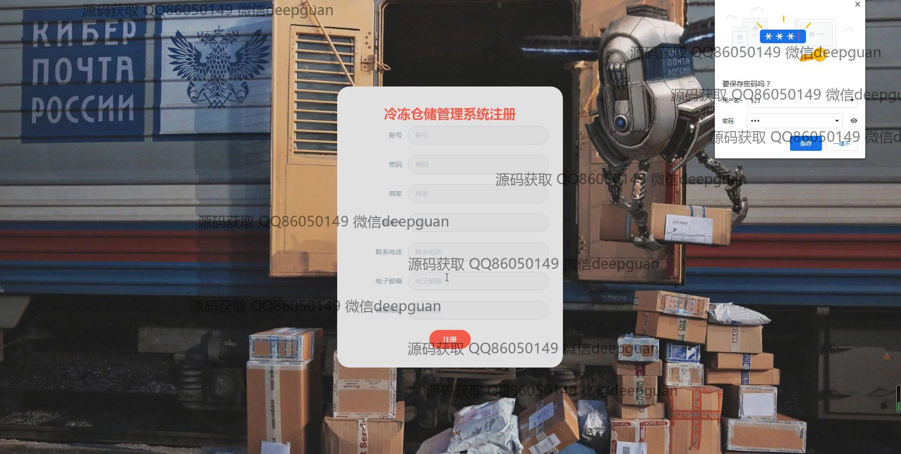
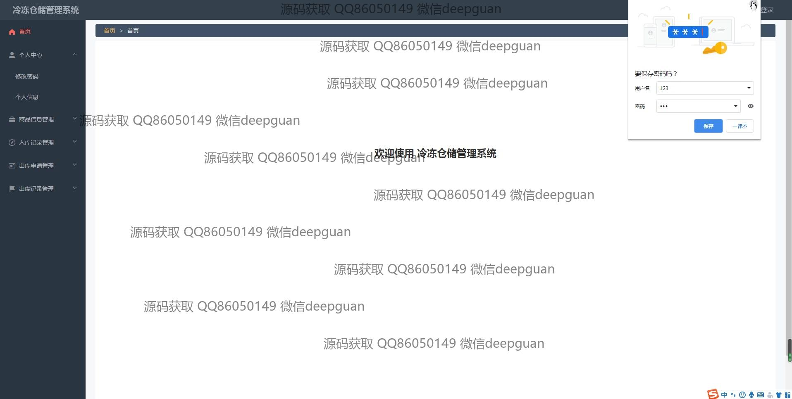

本代码来源于网络,仅供学习参考使用!

